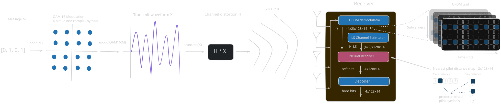
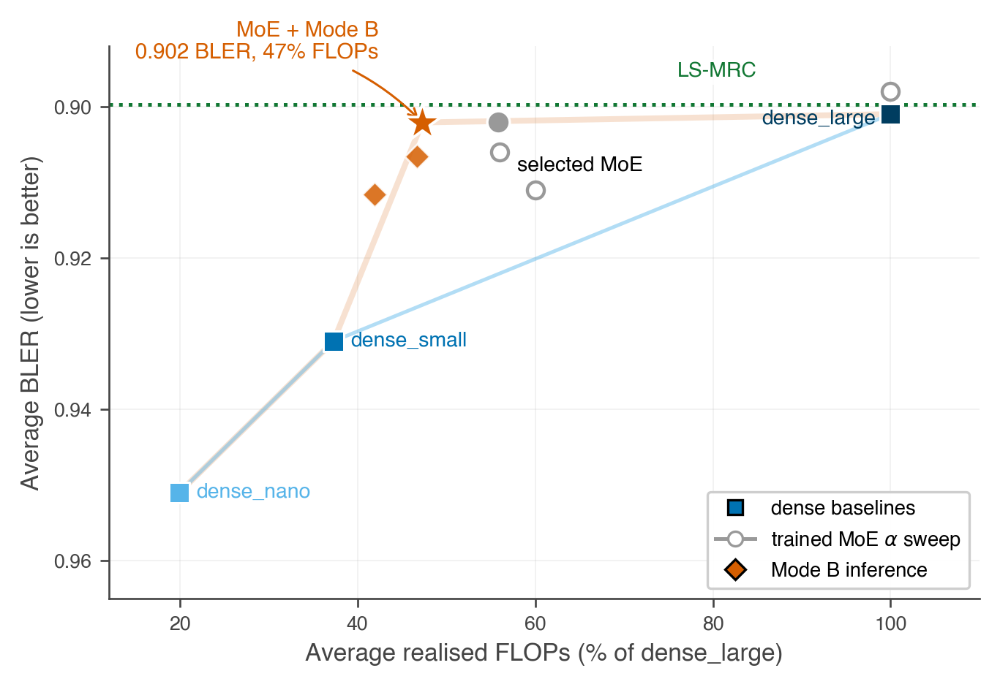
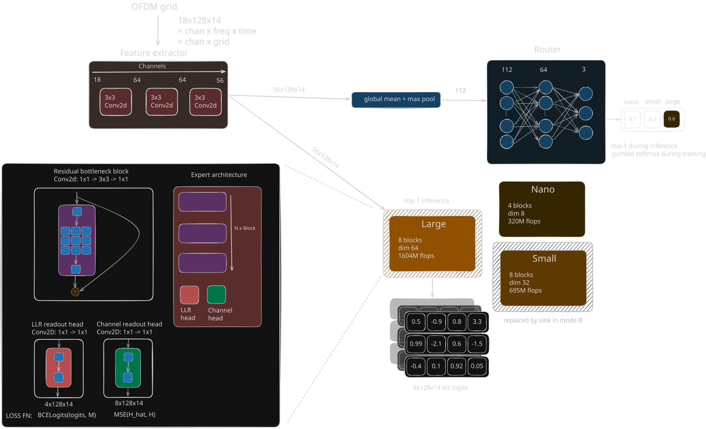

# Compute-Aware Mixture-of-Experts Neural Receiver for 5G/6G

This repository contains a 5G neural receiver prototype that reduces average
inference compute by routing each received OFDM slot to a differently sized CNN
expert. The project was developed as a KNN course project at FIT VUT.

The final receiver matches the quality of a dense-large neural receiver on the
locked UMa + TDL-C test set while using less than half of its realized neural
FLOPs.

[Final report](projekt.pdf)



## Summary

The receiver maps a received OFDM resource grid to soft bit estimates. A dense
CNN can solve this task, but it spends the same compute on every slot regardless
of channel quality. We instead use a compute-aware Mixture-of-Experts receiver:

- a shared CNN stem extracts `56 x 128 x 14` channel-aware features,
- a lightweight router selects one expert per received slot,
- experts trade off compute and capacity (`nano`, `small`, `large`),
- training uses bit BCE, auxiliary channel MSE, FLOPs penalty, and load balancing,
- final inference uses top-1 routing with Mode B replacing the small expert by a
  zero-output sink.

## Data

Training and evaluation data are generated synthetically with NVIDIA Sionna.

- Channel profiles: UMa and TDL-C
- Receiver setting: SIMO `1 x 4`
- Modulation: 16-QAM
- OFDM grid: `128` subcarriers x `14` OFDM symbols
- Input channels: received grid, LS channel estimate, and pilot-distance maps
- Output: `4 x 128 x 14` bit logits

The final evaluation is performed on locked test sets for UMa and TDL-C. The
report also includes OOD checks on ray-traced DeepMIMO/ASU-style data.

## Results

| Method | Channel info | Avg BLER | UMa | TDL-C | Avg FLOPs |
| --- | --- | ---: | ---: | ---: | ---: |
| Single-antenna | none | 0.9950 | 0.9922 | 0.9978 | n/a |
| Genie-MRC (oracle) | true H | **0.8544** | 0.9084 | 0.8003 | n/a |
| LS-MRC | LS pilots | 0.8997 | 0.9388 | 0.8607 | n/a |
| dense_nano | LS+net | 0.951 | 0.961 | 0.941 | 320 M |
| dense_small | LS+net | 0.931 | 0.951 | 0.911 | 599 M |
| dense_large | LS+net | 0.901 | 0.936 | 0.866 | 1604 M |
| **MoE + Mode B (ours)** | LS+net | **0.9021** | 0.937 | 0.867 | **759 M** |

Key interpretation:

- The final MoE matches dense-large neural receiver quality at `47%` of
  dense-large FLOPs.
- The gain is against dense neural receivers; LS-MRC remains a strong classical
  baseline in this SIMO setting.
- The small expert is useful during optimization, but can be replaced by a sink
  at inference without measurable BLER loss.
- The training recipe is asymmetric: shared stem, nano, and small are
  warm-started from dense checkpoints, while the large expert starts cold.



## Model

The main implementation lives in `src/models/`:

- `dense.py` - dense CNN receiver and residual bottleneck blocks
- `moe.py` - shared-stem MoE receiver, router, Gumbel-softmax training path, and
  top-1 inference path
- `warm_start.py` - loading dense checkpoints into MoE stem/experts



The canonical architecture uses:

| Expert | Blocks | Block dim | Readout dim | Total FLOPs |
| --- | ---: | ---: | ---: | ---: |
| nano | 4 | 8 | 32 | 320 M |
| small | 8 | 32 | 96 | 695 M |
| large | 8 | 64 | 128 | 1604 M |

FLOPs are counted analytically in `src/utils/compute.py` as multiply-add
operations for convolutional and linear layers.

## Training Recipe

The headline run is based on the `exp26_moe_alphasweep_a2e3` Hydra preset:

- mixed UMa/TDL-C training batches,
- asymmetric warm-start,
- Gumbel-softmax routing during training,
- hard top-1 expert selection during inference,
- `alpha = 2e-3` FLOPs penalty,
- `beta = 0.1` load-balancing penalty.

Relevant experiment folders:

- `experiments/2026-04-25-moe-alpha-sweep-v1/`
- `experiments/2026-04-25-moe-asym-a2e3-3seed-v1/`
- `experiments/2026-04-30-anti-collapse-sweeps-v1/`
- `experiments/2026-05-01-inference-mask-v1/`
- `experiments/2026-05-01-synthesis-sink-small-large-v1/`

## Running

Install dependencies:

```bash
uv sync --python 3.10 --dev
```

Run a short smoke test:

```bash
uv run python main.py experiment=exp01_baseline training.max_steps=100
```

Run the main MoE preset:

```bash
uv run python main.py experiment=exp26_moe_alphasweep_a2e3
```

Run with WandB logging:

```bash
export WANDB_PROJECT=moe-5g-nrx
export WANDB_ENTITY=<your-entity>
wandb login
uv run python main.py experiment=exp26_moe_alphasweep_a2e3
```

## Repository Layout

```text
conf/         Hydra configs and experiment presets
experiments/  Submitted experiment batches and notes
report/       LaTeX report source and final figures
scripts/      MetaCentrum helpers and selected plotting scripts
src/          Data generation, models, training, metrics, FLOPs utilities
main.py       Training entry point
projekt.pdf   Final compiled report
```

## Limitations

The final result should be read as a compute-aware neural receiver study, not as
a production modem. Important open directions are stronger LMMSE/MMSE baselines,
full coded transmission with LDPC/CRC/HARQ, multiple MCS settings, multi-user or
MIMO extensions, hardware-aware sparse dispatch, and more robust transfer to
ray-traced or measured channels.
