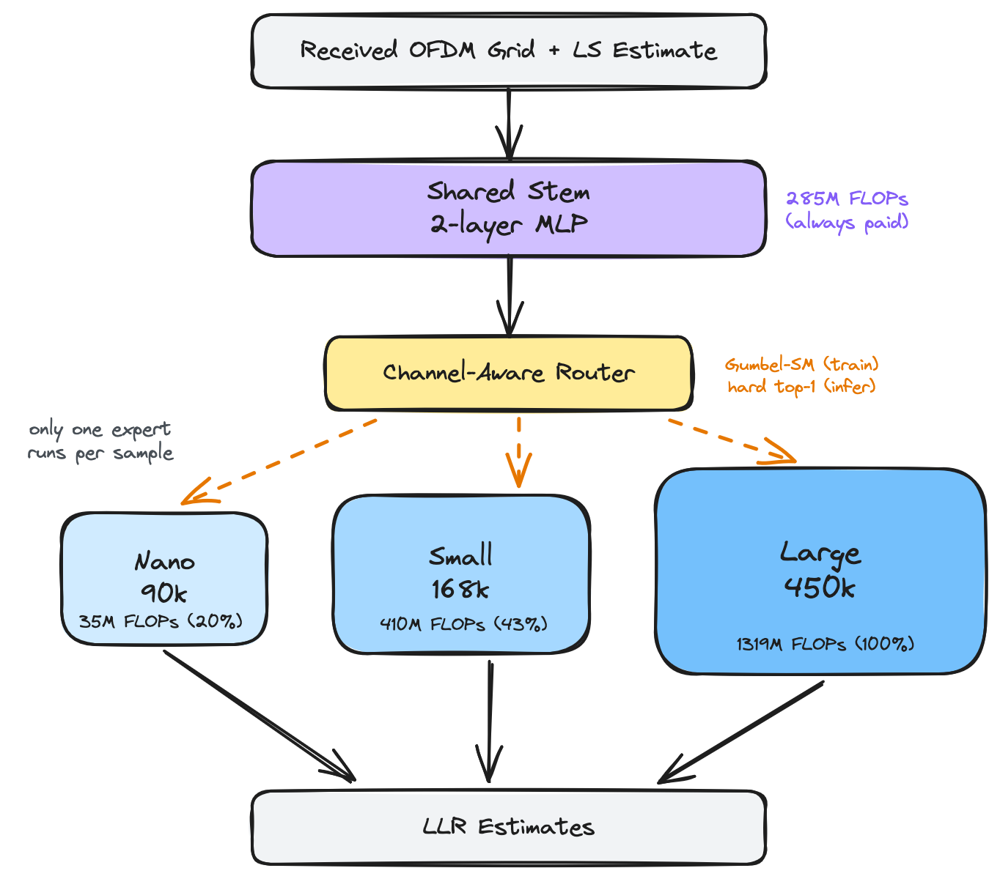
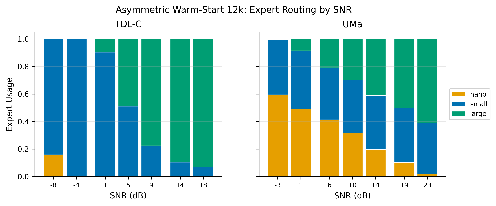
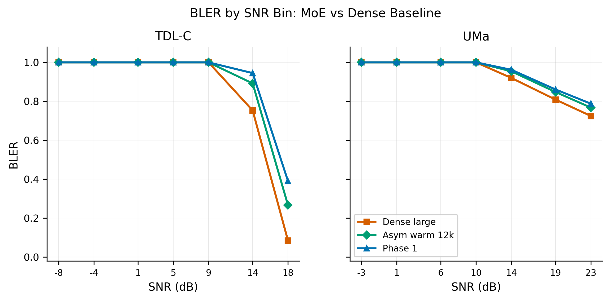

# Compute-Aware Mixture-of-Experts for Efficient 5G Neural Receiver

**Team:** Dominik Huml (xhumld00), Jakub Kontrik (xkontr02), Martin Vaculik (xvaculm00)

## 1. Problem Statement

Modern 5G neural receivers (NRX) achieve strong decoding performance but apply the same computational effort to every received signal, regardless of channel quality. In practice, most received slots are "easy" (high SNR, line-of-sight) and could be decoded by a lightweight model, while only a fraction require a full-capacity receiver. This uniform compute allocation wastes energy and processing resources, which is a problem for mobile devices with limited battery and thermal budgets.

We propose a **compute-aware NRX** using a Mixture-of-Experts (MoE) architecture with **heterogeneous experts** of different sizes. A learned router examines features extracted from the received OFDM resource grid and selects one expert per sample: a lightweight expert for easy channels, a full-capacity expert for difficult ones. The key metric is the **BLER vs. average FLOPs tradeoff**: we aim to reduce inference compute while maintaining block error rate close to a static dense baseline.

## 2. Related Work

**Wiesmayr et al. (2024)** define the modern neural receiver architecture for OFDM systems, providing our dense baseline design. Their model achieves strong BLER but is static and computationally expensive.

**Van Bolderik et al. (2024), MEAN** apply MoE to 5G neural receivers as a proof-of-concept. However, MEAN uses homogeneous experts (same architecture, same compute cost) and focuses on per-SNR specialisation rather than compute efficiency. Our work addresses a different objective: heterogeneous expert sizing for adaptive compute allocation. MEAN's gating network uses raw received samples as input; our router operates on pooled features from a shared stem.

**Van Bolderik et al. (2026), LOREN** extends the MoE direction with LoRA adapters for different network configurations, focusing on memory efficiency rather than compute efficiency.

**Song et al. (2025)** introduce channel-aware gating for wireless networks. Our router design builds on this idea, using channel-quality features extracted by the shared stem to inform routing decisions.

## 3. Architecture

_Figure 1: Compute-aware MoE architecture. The shared stem (285M FLOPs) feeds a channel-aware router that selects one of three heterogeneous experts per sample. Only the selected expert runs at inference._

Our model consists of three components:

**Shared stem.** A two-layer MLP (hidden dims [64, 64], state_dim=56) that processes the concatenated received signal and LS channel estimate. The stem extracts features used by both the router and the selected expert. Its compute cost is fixed (285M FLOPs) and always paid.

**Channel-aware router.** A small network (hidden_dim=64) that takes pooled stem features and produces a probability distribution over experts. During training, we use Gumbel-Softmax soft gating for differentiability. At inference, hard top-1 selection ensures only one expert executes, so the FLOPs savings are real (not amortized).

**Heterogeneous experts.** Three CNN-based expert heads with different capacities:

| Expert | Backbone         | Params | Expert FLOPs | Total FLOPs | % of large |
| ------ | ---------------- | -----: | -----------: | ----------: | ---------: |
| nano   | 4 blocks, dim=8  |    90k |          35M |        320M |        20% |
| small  | 8 blocks, dim=32 |   168k |         410M |        695M |        43% |
| large  | 8 blocks, dim=64 |   450k |        1319M |       1604M |       100% |

Routing nano instead of large saves **80% of total FLOPs**. The total MoE model has 582k parameters.

**Training objective:**

$$L = L_{BCE} + \gamma \cdot L_{channel} + \alpha \cdot \mathbb{E}[\text{FLOPs ratio}] + \beta \cdot L_{balance}$$

where $L_{BCE}$ is the bit-level cross-entropy for LLR estimation, $L_{channel}$ ($\gamma$=0.05) regularises channel estimation quality, $\alpha$=1e-3 penalises expected compute, and $\beta$=0.1 encourages load balance across experts.

## 4. Evaluation Environment

**Dataset.** We use NVIDIA Sionna to simulate standard 3GPP channel models: UMa (urban macro, outdoor) and TDL-C (tapped delay line, indoor/NLOS). Training data (250k samples per channel profile) is hosted on HuggingFace (`Vack0/moe-5g-nrx`). Validation (8,192 samples per profile) and test (32,768 samples per profile) splits are pre-generated with Sionna and cached as `.pt` files. Each sample is a 5G NR slot: 14 OFDM symbols, 128 subcarriers, 3.5 GHz carrier, 16-QAM modulation, SIMO 1x4 antenna configuration.

**Metrics.** Our primary metric is **BLER** (Block Error Rate) - the fraction of transport blocks with at least one bit error. We evaluate at multiple SNR bins to capture the waterfall curve, with particular attention to the high-SNR transition region (SNR=17 dB for TDLC) where expert quality differences are most pronounced. Compute efficiency is measured as **average realized FLOPs** at inference under hard top-1 routing.

**Infrastructure.** Training runs on the MetaCentrum PBS cluster (1 GPU, 12 CPUs per job). Experiment tracking via Weights & Biases. Checkpoints are versioned as W&B artifacts.

## 5. Baseline Results

We trained three dense (non-MoE) receivers to convergence (20k steps each) as baselines:

| Model           | TDLC BLER | UMA BLER  | TDLC BLER@SNR=17 | FLOPs     |
| --------------- | --------- | --------- | ---------------- | --------- |
| dense nano      | 0.971     | 0.961     | 0.722            | 320M      |
| dense small     | 0.911     | 0.951     | 0.548            | 695M      |
| **dense large** | **0.866** | **0.936** | **0.284**        | **1604M** |

The waterfall region (SNR 15-19 dB on TDLC) shows a **44 percentage point BLER gap** between nano and large at SNR=17, confirming that expert size matters and justifying the MoE approach.

_Figure 2: BLER across the TDLC waterfall region for the three dense baselines. The 44 pp gap at SNR=17 between nano and large justifies heterogeneous MoE routing._

## 6. First MoE Experiments

### 6.1 Phase 1 - Joint Training from Scratch

All three experts and the router are initialised randomly and trained jointly for 10k steps. The FLOPs penalty ($\alpha$=1e-3) drives the router progressively toward cheaper experts, achieving **48% average FLOPs**. At the best checkpoint (step 9000), the router still sends ~30% of traffic to large on average, but with strong profile asymmetry: 39% large on TDLC vs only 20% on UMA (where nano dominates at 66%). By the end of training (step 10k), large usage drops to ~0%, suggesting the penalty would eventually collapse routing entirely given more steps.

**Test result:** avg BLER = 0.926, avg FLOPs = 772M (48% of dense large).

### 6.2 Phase 2 - Warm-Start with Staged Training

Each expert is initialised from its matching pre-trained dense checkpoint. Training proceeds in two stages: 2k steps with experts frozen (router learns to distribute), then 10k steps of joint fine-tuning.

**Result: complete router collapse.** The warm-started large expert is strictly better than nano/small from step 1, so the router sends 100% of traffic to large and never redistributes. The model converges to a fine-tuned dense large, giving excellent BLER but zero compute savings.

**Test result:** avg BLER = 0.879, avg FLOPs = 1604M (100%).

### 6.3 Anti-Collapse Experiments

We tested five approaches to break the Phase 2 router collapse:

| Mechanism                                | Routing diversity         | BLER         | Outcome                                  |
| ---------------------------------------- | ------------------------- | ------------ | ---------------------------------------- |
| Stronger load balance ($\beta$=0.5, 1.0) | Collapsed                 | Good         | MSE penalty too weak                     |
| Very strong load balance ($\beta$=2.0)   | 33/33/33 uniform          | Poor (0.971) | Forced-uniform, experts can't specialise |
| Soft capacity constraint                 | Collapsed after unfreeze  | Good         | Insufficient penalty weight              |
| Switch Transformer aux loss              | Collapsed                 | --           | Weight too low                           |
| **Asymmetric warm-start**                | **33/29/38 (all active)** | **0.913**    | **Positive result**                      |

### 6.4 Asymmetric Warm-Start - Key Finding

The breakthrough came from attacking the root cause: **remove the warm-start advantage from large.** We warm-start stem + nano + small from dense checkpoints but leave large at random initialisation. Without an initial quality advantage, the router has no reason to collapse onto large.

At 6k steps, the router used only nano+small (large was still untrained). We extended the run to 12k steps using checkpoint resume, and **large "woke up"** - the router discovered it once it became competitive (~step 8000-10000).

_Figure 3: Expert usage during asymmetric warm-start training. Large (random init) crashes to ~0% by step 2000, then begins receiving traffic again at step ~6550, reaching competitive usage by ~8000-10000._

Test-split evaluation shows that the routing is **adaptive across channel profiles**:

| Profile           | large     | nano  | small | Realized FLOPs |
| ----------------- | --------- | ----- | ----- | -------------- |
| **TDLC** | **45.5%** | 2.4%  | 52.1% | 1100M          |
| **UMA**  | 30.2%     | 30.5% | 39.3% | 856M           |

The router allocates significantly more traffic to the large expert on the harder TDLC channel (45.5% vs 30.2%), while using more of the lightweight nano expert on the easier UMA channel (30.5% vs 2.4%). This is the compute-adaptive behaviour the architecture was designed for.

### 6.5 Per-SNR Routing Analysis

Decomposing expert usage by SNR bin reveals that the router has learned a **difficulty-dependent routing policy** within each channel profile:

_Figure 4: Expert usage per SNR bin on the test split. On TDLC, the router transitions from small-dominated routing at low SNR to large-dominated routing in the waterfall region (SNR > 9 dB). On UMA, nano dominates at low SNR with a gradual shift toward large at high SNR._

On TDLC, at SNR=-8 dB the router sends 84% to small and 16% to nano (large is never used), while at SNR=18 dB it sends 93% to large. The crossover happens in the waterfall region (SNR 5-9 dB) where expert quality differences matter most.

The router does **not** follow a naive "hard->large, easy->nano" policy. At very low SNR where all experts fail (BLER=1.0), it saves compute by routing to small rather than wasting FLOPs on large. It only uses large in the waterfall region where large can actually reduce errors.

_Figure 5: BLER comparison across SNR bins. At high SNR (TDLC, 18 dB), asymmetric warm-start (0.267) approaches the dense large baseline (0.085) and beats Phase 1 (0.391) by 12 pp. Below the waterfall, all models saturate at BLER=1.0._

## 7. Preliminary Results

| Run                    | Routing      | Avg BLER  | Avg FLOPs | FLOPs % |
| ---------------------- | ------------ | --------- | --------- | ------- |
| Dense large (baseline) | --           | 0.901     | 1604M     | 100%    |
| Phase 2 v1 (collapsed) | 100% large   | 0.879     | 1604M     | 100%    |
| **Asym warm 12k**      | **46/2/52 (tdlc) 30/31/39 (uma)** | **0.910** | **978M**  | **61%** |
| Phase 1 s56            | 39/36/24 (tdlc) 20/66/14 (uma) | 0.926     | 772M      | 48%     |

The asymmetric warm-start run is within **0.9 pp BLER** of the dense large baseline while using only **61% of the FLOPs**, with the router adapting compute allocation to channel difficulty.

We also identify a key characterisation finding: **opposite failure modes** in heterogeneous MoE training. Joint-from-scratch (Phase 1) over-penalises the expensive expert, while full warm-start (Phase 2) cannot escape the dominant expert. Asymmetric warm-start resolves this by letting the large expert earn its traffic through training rather than receiving it by default.

_Figure 6: BLER vs FLOPs Pareto frontier. Grey squares are dense baselines. Coloured circles are MoE runs. The line connects Pareto-optimal points. Asymmetric warm-start 12k (green) fills the gap between the collapsed Phase 2 (best BLER, max FLOPs) and Phase 1 (cheapest, worst BLER)._

## 8. Limitations & Next Steps

**Limitations.** On TDLC at realistic SNR, the effective routing is between small and large, with nano absorbing only hopeless low-SNR samples; UMA still routes ~30% through nano. A 2-expert ablation is needed to determine whether nano contributes at all. Results are from a single seed (s67) and the FLOPs penalty (alpha=1e-3) was inherited from Phase 1 without tuning for the asymmetric warm-start recipe.

**Next steps.** We plan to extend training to 20k steps to see if longer training closes the BLER gap further. After that, an alpha sweep to map the full Pareto curve and find operating points where all experts contribute at realistic SNR. We also want to try difficulty-guided routing, using per-sample SNR as a training-time supervision signal to encourage expert specialisation without requiring SNR at inference. Finally, out-of-distribution evaluation on DeepMIMO ray-traced channels and multi-seed runs for robustness.

## References

- Wiesmayr, R. et al. (2024). OFDM-based Neural Receivers. arXiv:2409.02912
- van Bolderik, E. et al. (2024). MEAN: Mixture of Experts with Attention for 5G. IEEE PIMRC.
- van Bolderik, E. et al. (2026). LOREN: LoRA-Enhanced Neural Receiver. arXiv:2602.10770
- Song, J. et al. (2025). Channel-Aware Gating for Wireless Networks. IEEE TWC.
